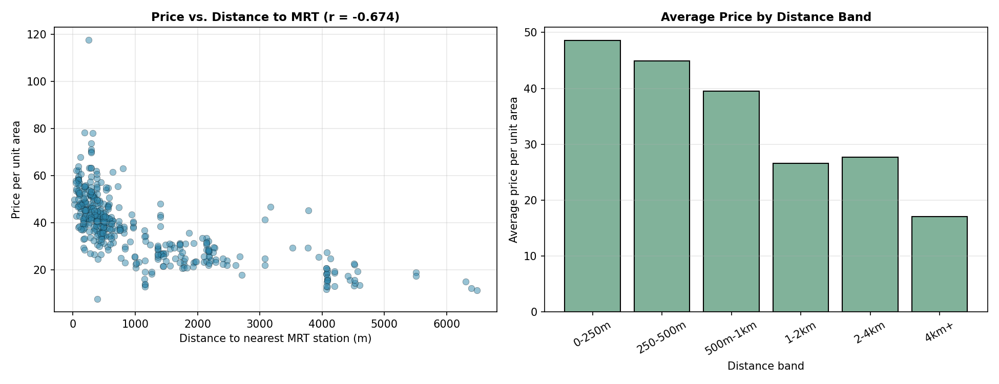
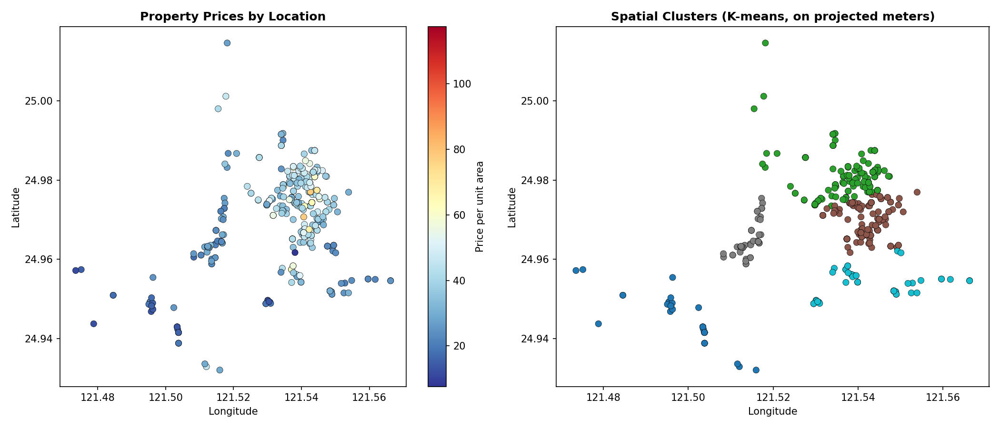

# Real Estate Geospatial Analysis — Xindian District, New Taipei City

A geospatial analysis of 414 real property transactions: spatial
clustering (K-means and DBSCAN on correctly projected coordinates, not
raw lat/lon), proximity-to-transit pricing analysis, and an interactive
multi-layer Folium map — the kind of deliverable that's directly
applicable to real estate, logistics, or site-selection freelance work.

## About the data

**Real data**, not synthetic. Source: the well-known
[UCI "Real estate valuation data set"](https://github.com/subashgandyer/datasets/blob/main/Real%20estate.csv)
(Yeh & Hsu, 2018) — 414 property transactions from Xindian District,
New Taipei City, Taiwan, including transaction date, house age,
distance to the nearest MRT (metro) station, number of nearby
convenience stores, latitude/longitude, and price per unit area.
Verified directly: 0 nulls, coordinates fall within a real ~9km × 9km
bounding box consistent with a single district.

## The detail most geospatial portfolio projects skip: projection

K-means and DBSCAN both rely on Euclidean distance between points.
Running them directly on raw (latitude, longitude) treats one degree
of longitude as the same physical distance as one degree of latitude —
which is wrong. At this dataset's latitude (~25°N), a degree of
longitude is about 9% shorter than a degree of latitude (`cos(25°) ≈
0.906`). Over a ~9km dataset that distortion is real, even if it looks
small on a quick scatter plot.

**This project always reprojects to EPSG:3826** (TWD97 / TM2, the
correct official projected coordinate system for Taiwan, in meters)
*before* running any clustering or distance calculation — never on raw
degrees. This is the difference between a geospatial analysis that
merely runs without throwing an error and one that's actually correct.
See `load_geodata.py` and `spatial_analysis.py` for where this happens
and why.

## Methodology

1. **Load as a proper GeoDataFrame** with `Point` geometries (not just
   two float columns), CRS explicitly set to WGS84 (EPSG:4326) on load.
2. **Reproject to EPSG:3826** (meters) before any clustering.
3. **K-means clustering** (5 clusters) for neighborhood-style
   segmentation — every property is assigned to its nearest cluster.
4. **DBSCAN clustering** (eps=400m, min_samples=5) as a second,
   density-based method that — unlike K-means — correctly identifies
   isolated/sparse properties as noise rather than forcing them into
   the nearest cluster. This matters because K-means alone would make
   an outlier property look like it "belongs" to a neighborhood it's
   actually nowhere near.
5. **Proximity-to-MRT pricing analysis**, binning properties into
   distance bands and computing average price per band.
6. **Interactive Folium map** with three toggleable layers.

## Results

### Finding 1: price correlates strongly with distance to transit

Correlation between distance-to-MRT and price: **r = -0.674**.



| Distance band | # properties | Avg price | Median price | Avg house age |
|---|---|---|---|---|
| 0-250m | 79 | 48.53 | 48.10 | 15.68 |
| 250-500m | 132 | 44.87 | 42.55 | 17.38 |
| 500m-1km | 65 | 39.52 | 39.00 | 22.98 |
| 1-2km | 65 | 26.59 | 26.20 | 17.02 |
| 2-4km | 40 | 27.70 | 26.50 | 13.40 |
| 4km+ | 33 | 17.06 | 16.70 | 20.13 |

Price declines by roughly **65%** from the closest band to the
farthest — a clear, economically sensible gradient. The one
non-monotonic step (1-2km vs. 2-4km, nearly tied) is real noise in
real data, not a modeling artifact — worth pointing out rather than
smoothing over, since claiming a perfectly monotonic relationship on
real data would be a red flag, not a strength.

### Finding 2: spatial clusters reveal distinct sub-markets



| Cluster | # properties | Avg price | Avg distance to MRT |
|---|---|---|---|
| 1 | 143 | 44.57 | 571m |
| 2 | 135 | 43.38 | 374m |
| 4 | 48 | 30.39 | 1,125m |
| 3 | 52 | 26.36 | 1,979m |
| 0 | 36 | 18.46 | 4,435m |

The two highest-value clusters (1 and 2) are also the two closest to
transit on average — the spatial clustering and the proximity analysis
independently confirm the same underlying pattern, which is a good
sign neither is a coincidence of how the bins/clusters happened to be
drawn.

DBSCAN (density-based) found **8 dense sub-clusters** and flagged
**27 properties (6.5%) as spatial outliers** — properties not part of
any dense neighborhood grouping. These are exactly the properties a
K-means-only analysis would have silently folded into a "neighborhood"
they don't really belong to.

### The interactive map

`output/property_map.html` — open this directly in a browser (GitHub's
README viewer cannot render interactive Folium maps inline, which is
why the static charts above exist alongside it). Three toggleable
layers:

1. **Properties colored by price** — click any point for full details
2. **Price-weighted heatmap** — shows WHERE expensive properties
   concentrate, not just where properties exist (weighting by price
   rather than just plotting point density is the deliberate choice
   that makes this layer say something a plain density heatmap
   wouldn't)
3. **Cluster centroids** — sized by property count, colored by average
   cluster price

## Repo structure

```
.
├── data/
│   └── real_estate_raw.csv         # real UCI dataset
├── scripts/
│   ├── load_geodata.py              # GeoDataFrame conversion, CRS handling
│   ├── spatial_analysis.py          # clustering + proximity analysis
│   └── build_map.py                 # the interactive Folium map
├── output/
│   ├── kmeans_cluster_summary.csv
│   ├── proximity_price_summary.csv
│   ├── properties_for_map.csv
│   ├── price_and_clusters.png
│   ├── proximity_price_analysis.png
│   └── property_map.html            # OPEN THIS IN A BROWSER
└── requirements.txt
```

## How to run it

```bash
pip install -r requirements.txt
python scripts/spatial_analysis.py   # runs clustering + proximity analysis, saves CSVs
python scripts/build_map.py          # builds output/property_map.html
```

Then open `output/property_map.html` directly in any browser.

## What I'd add with more time

- Voronoi tessellation around each MRT station to define exact
  "closest station" catchment areas, rather than using the dataset's
  pre-computed straight-line distance
- A proper spatial autocorrelation test (Moran's I) to formally
  quantify whether the price clustering is statistically significant
  spatial structure, not just visually apparent
- Overlay actual MRT line geometry (as a LineString layer) on the
  Folium map for direct visual context, rather than only showing
  property points

## Tech stack

GeoPandas · Shapely · Folium + branca (interactive mapping) ·
scikit-learn (K-means, DBSCAN) · pandas · matplotlib
